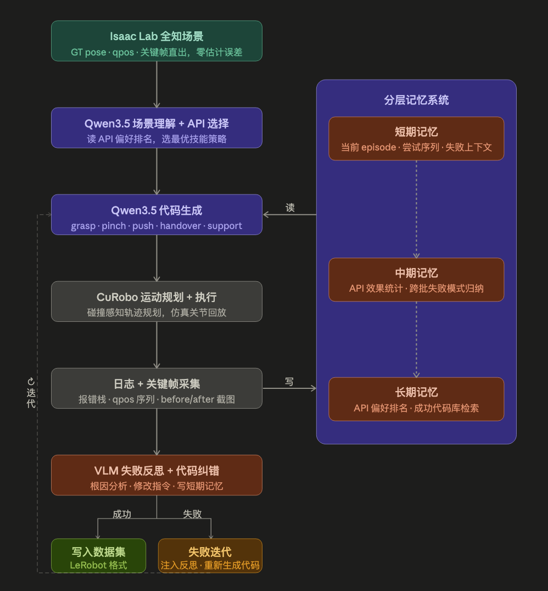
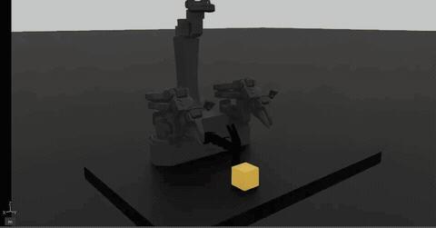
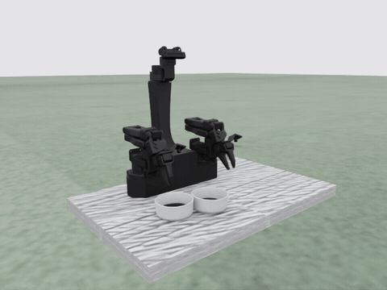
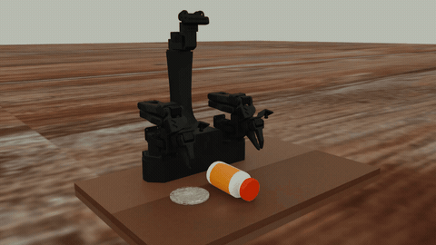
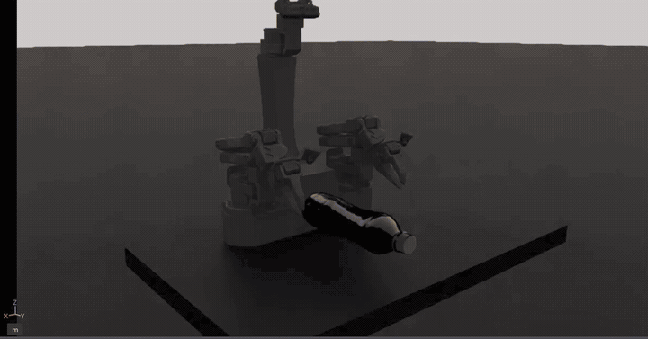

# Hi there, I'm 孙浩翔 👋

> **M.S. in Mechanical Engineering @ 浙江大学 | B.S. in Physics** 
> 🤖 **Focus:** VLA · Language-Action Alignment · Robot Learning · Sim-to-Real

欢迎来到我的机器人项目集。目前重点探索语言指令与机器人动作的对齐、自动生成操作数据，以及双臂机器人从仿真到真机的迁移。

---

## 🛠️ Tech Stack

---

## Theoretical Algorithms | 理论验证
> *关注经典算法的数学原理复现与特定场景下的优化。*

#### 1. Autonomous Navigation: A* 路径规划与最小加加速度轨迹优化
**关键词**: `Motion Planning` `A* Algorithm` `Trajectory Smoothing` `Minimum Jerk` `ROS`

> **项目概述**:  
> 基于 ROS 的移动机器人导航系统。在经典 A* 搜索的基础上，结合物理约束（动力学）进行了后端轨迹优化，实现了在复杂障碍物环境下的平滑避障。

[观看 A* 路径规划演示](https://github.com/user-attachments/assets/9e20aeb9-ac9a-467e-a40d-be3237b12ef5)

**✨ 核心功能 (Key Features):**
* **🎯 前端搜索**: 实现 **A*** 算法，并通过启发式函数优化（Heuristic Optimization）提升在随机障碍物环境下的搜索效率。
* **🌊 后端平滑**: 采用 **5次多项式 (Quintic Polynomial)** 进行轨迹插值，解析求解 **Minimum Jerk**（最小加加速度）轨迹，确保速度与加速度连续。
* **📊 可视化交互**: 集成 RViz 实时可视化，动态展示搜索过程（Open/Closed Set）与优化后的平滑轨迹。

---

#### 2. PCB Defect Detection: 基于 Faster R-CNN 的缺陷检测系统
**关键词**: `Computer Vision` `Faster R-CNN` `ResNet-50 FPN` `WandB` `GUI Deployment`

> **项目概述**:  
> 针对工业场景下的 PCB 缺陷检测，对比实现了两套 **Faster R-CNN** 方案：基于 torchvision 的工程化实现与基于底层网络构建的完整复现。项目集成 MLOps 工具流与桌面端部署应用。

[观看 PCB 缺陷检测演示](https://github.com/user-attachments/assets/886da69d-a7b3-4c36-8a89-d5e3f94cbe37)

**✨ 核心功能 (Key Features):**
* **🔍 双重架构对比**: 
    * **自研方案**: 基于 `torchvision` 预训练模型，集成 **WandB** 进行贝叶斯超参搜索（Bayesian Sweep），优化 ResNet-50 + FPN 的特征提取能力。
    * **底层复现**: 从零构建 RPN (Region Proposal Network) 与 RoI Heads，深入理解 Anchor 生成与 NMS 筛选机制。
* **⚙️ 完整工程流**: 实现 VOC 格式数据流水线，支持 Mosaic/Mixup 等数据增强策略。
* **🖥️ 部署与交互**: 开发 **Tkinter/PyQt5** 双版本 GUI，支持单图推理与视频流实时检测，实现工业级交互体验。

---

## 🚀 Featured Project | 精选项目

### VLA Language-Action 对齐与自动数据闭环

**项目开发者 | 2026.01 至今** 
`XLeRobot` `Isaac Lab` `Isaac Sim` `cuRobo` `Robot API` `LLM Agent` `LeRobot`

围绕双臂操作中的语言语义与动作耦合问题，构建从**自然语言任务、可执行技能 API 到连续运动轨迹**的对齐流程，并让 Agent 根据执行反馈自动生成和修正训练数据。

#### Language-Action 对齐与真机迁移

- 将自然语言任务拆解为 `grasp`、`pinch`、`push`、`support`、`rotate`、`handover` 等可调用操作，再映射到轨迹规划与底层机器人动作，采集细粒度的语言—动作对应数据。
- 基于 XLeRobot / Isaac Lab 搭建双臂训练与验证环境，完成仿真策略向真实人形机器人双臂平台的迁移与验证。

#### Agent 驱动的自动数据生成

- 集成 Isaac Lab、cuRobo、Robot API 与 LLM Agent。Agent 结合视觉语言模型对物体和操作的语义判断，选择技能并生成控制代码；cuRobo 在碰撞约束下规划轨迹，再通过统一 API 执行。
- 记录任务日志、关键帧与失败轨迹；Memory System 汇总执行经验，供 Agent 分析失败原因、修改代码并重新规划。成功轨迹写入 LeRobot 格式数据集，形成可迭代的数据生产流程。

**系统流程**

**XLeRobot 仿真操作 Demo**

<table>
  <tr>
    <td align="center"><b>1. 方块操作</b> </td>
    <td align="center"><b>2. 碗具操作</b> </td>
  </tr>
  <tr>
    <td align="center"><b>3. 圆柱物体操作</b> </td>
    <td align="center"><b>4. 瓶状物体操作</b> </td>
  </tr>
</table>
